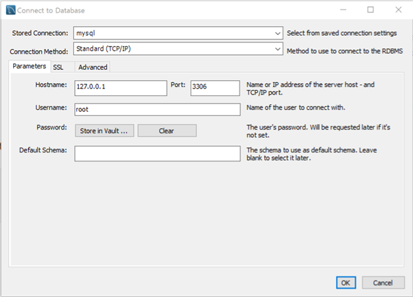
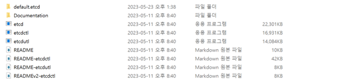

# gRPC-todoList

gin+grpc+gorm+etcd+mysql 的备忘录功能


# 项目主要依赖
- gin
- gorm
- etcd
- grpc
- jwt-go
- logrus
- viper
- protobuf

# 准备工作
## 下载gRPC

```
Gin+gRPC make service of Realization Memo
Knowing what is RPC call
err = client.Call("Arith.Multiply", args, &reply)

Get golang RPC package and install
go get google.golang.org/grpc
go get google.golang.org/protobuf
https://github.com/protocolbuffers/protobuf/releases/tag/v3.15.5
```

## 创建MySQL数据库


```
create database grpc_todo_list;
show databases;
```


# 项目结构

## 1. api-gateway 网关部分

```
api-gateway/
├── cmd                   // 启动入口
├── config                // 配置文件
├── discovery             // etcd服务注册、keep-alive、获取服务信息等等
├── internal              // 业务逻辑（不对外暴露）
│   ├── handler           // 视图层
│   └── service           // 服务层
│       └──pb             // 放置生成的pb文件
├── logs                  // 放置打印日志模块
├── middleware            // 中间件
├── pkg                   // 各种包
│   ├── e                 // 统一错误状态码
│   ├── res               // 统一response接口返回
│   └── util              // 各种工具、JWT、Logger等等..
├── routes                // http路由模块
└── wrappers              // 各个服务之间的熔断降级
```

## 2. user && task 用户与任务模块


```
user/
├── cmd                   // 启动入口
├── config                // 配置文件
├── discovery             // etcd服务注册、keep-alive、获取服务信息等等
├── internal              // 业务逻辑（不对外暴露）
│   ├── handler           // 视图层
│   ├── cache             // 缓存模块
│   ├── repository        // 持久层
│   └── service           // 服务层
│       └──pb             // 放置生成的pb文件
├── logs                  // 放置打印日志模块
└── pkg                   // 各种包
    ├── e                 // 统一错误状态码
    ├── res               // 统一response接口返回
    └── util              // 各种工具、JWT、Logger等等..
```
```
task/
├── cmd                   // Launch Portal
├── config                // Configuration file
├── discovery             // etcd service registration, keep-alive, etc.
├── internal              // Business logic (not exposed to the public)
│   ├── handler           // View Layer
│   ├── cache             // Cache Module
│   ├── repository        // Durable layer
│   └── service           // Service layer
│       └──pb             // Placing the generated pb file
├── logs                  // Placement of print log module
├── pkg                   // Various packages
│   ├── e                 // Unified Error Status Code
│   ├── res               // Unified response interface returns
│   └── util              // Various tools, JWT, Logger, etc...
```

# 项目文件配置

各模块下的`config/config.yml`文件


```yaml
server:
# 模块
  domain: user
  # 模块名称
  version: 1.0
  # 模块版本
  grpcAddress: "127.0.0.1:10001"
  # grpc地址

datasource:
# mysql数据源
  driverName: mysqlMaster
  host: 127.0.0.1
  port: 3306
  database: basicInfo
  # 数据库名
  username: root
  password: root
  charset: utf8mb4

etcd:
# etcd 配置
  address: 127.0.0.1:2379

redis:
# redis 配置
  address: 127.0.0.1:6379
  password:
```

# ETCD Service


# 项目启动
保证etcd处于运行状态。
- 在各模块下进行

```go
go mod tidy
```

- 在各模块下的cmd目录

```go
go run main.go
```
